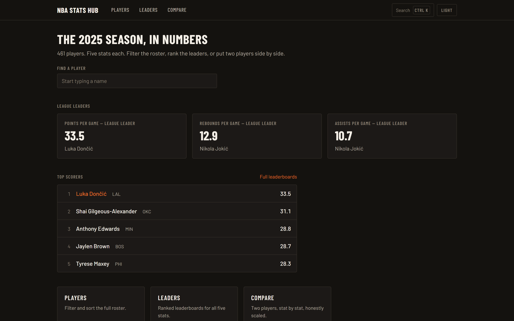
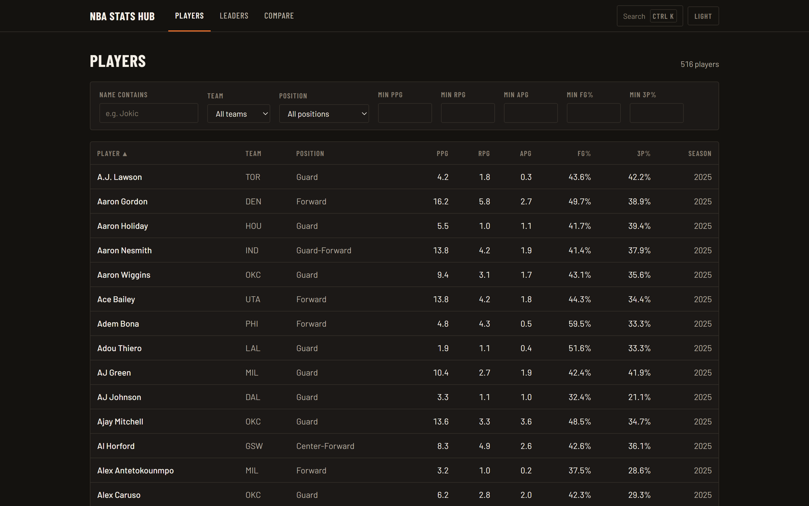
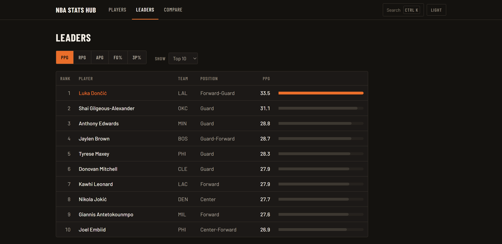
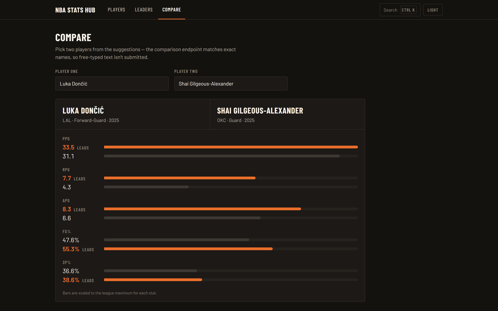

# NBA Player Stats Hub

[](https://github.com/CristianNieto3/nba-stats-api/actions/workflows/ci.yml)
[](LICENSE)

Spring Boot REST API for retrieving, searching, filtering, sorting, comparing, and maintaining NBA player statistics, plus a Next.js dashboard frontend in `frontend/`.



## Live demo

<!-- The -six suffix is part of the hostname, not a typo. Vercel appended it
     because nba-stats-hub.vercel.app was already taken; that bare subdomain is
     an unrelated account's NBA stats site, so it serves a healthy 200 and looks
     plausible. WebConfigCorsTest asserts the bare name is rejected by CORS. -->

| | |
| --- | --- |
| **Dashboard** | https://nba-stats-hub-six.vercel.app |
| **API** | https://nba-stats-api-4jl6.onrender.com/api/v1/players/page?page=0&size=5 |

Real data for the 2025-26 season, refreshed from `stats.nba.com`: every active
player with a game played, 516 of them at the most recent refresh.

> **First load may take up to two minutes.** The API runs on Render's free tier,
> which spins the service down after 15 minutes idle; the cold start costs about
> 115 seconds. A [scheduled ping](.github/workflows/keep-api-warm.yml) keeps it
> warm on weekday daytimes (09:00-19:00 ET), so outside those hours the first
> request pays the wake-up cost. The dashboard is not broken, just waking up.

## Screenshots

| | |
| --- | --- |
| **Roster explorer** — filter by name, team, position, and stat minimums, then sort any column. | **Leaderboards** — ranked per statistic, with bars scaled to the league maximum. |
| [](docs/screenshots/players.png) | [](docs/screenshots/leaders.png) |

**Compare** — two players, one stat per row, bars scaled to the league maximum so the gaps are honest.

[](docs/screenshots/compare.png)

## Architecture

```text
Next.js dashboard  ->  Spring Boot REST API  ->  PostgreSQL (Supabase)
   (Vercel)                 (Render)                     ^
                                                         |
                                       Python loader (data-loader/), run locally
                                       because stats.nba.com blocks datacenter IPs
```

## Frontend

The dashboard lives in `frontend/` (Next.js App Router + TypeScript + Tailwind CSS) and talks to the running backend:

```powershell
cd frontend
npm install
npm run dev
```

It expects the API at `http://localhost:8080` (override with `NEXT_PUBLIC_API_BASE_URL` in `frontend/.env.local`) and runs at `http://localhost:3000`, which matches the backend's default CORS origin. Pages: home overview, roster explorer (`/players`), player detail, leaderboards (`/leaders`), side-by-side compare (`/compare`), and an admin-authenticated management screen (`/manage`) that requires signing in before it can write.

## Tech stack

- Java 21
- Spring Boot 3.4
- Spring Web, Spring Data JPA, and Jakarta Bean Validation
- PostgreSQL
- Maven Wrapper
- H2 for automated tests

## Project layout

Three deployable pieces in one repository. The runnable Maven project is in
`nbastats/`.

```text
nbastats/         Spring Boot REST API -> Render
  src/main/java/com/cristian/nbastats/
    config/       CORS and HTTP Basic security configuration
    error/        Consistent API error handling
    player/       Player controller, service, repository, entity, and DTOs
  src/main/resources/
    application.properties
    application-prod.properties
    nba_players.csv          12-row starter fixture

frontend/         Next.js App Router dashboard -> Vercel
  src/app/        Routes: home, players, leaders, compare, manage
  src/components/ Shared UI
  src/lib/        API client, auth, formatting, hooks

data-loader/      Python loader for stats.nba.com -> run locally, not in CI
```

## Requirements

- Java 21
- PostgreSQL
- A PostgreSQL database named `nba`

## Configuration

Copy the example environment file:

```powershell
cd nbastats
Copy-Item .env.example .env
```

Update `.env` with your local database password. Spring imports this file when the application starts from the `nbastats` directory. `.env` is ignored by Git.

| Variable | Default | Purpose |
| --- | --- | --- |
| `DB_URL` | `jdbc:postgresql://localhost:5432/nba` | PostgreSQL JDBC URL |
| `DB_USERNAME` | `postgres` | Database username |
| `DB_PASSWORD` | none | Database password |
| `JPA_DDL_AUTO` | `validate` | Hibernate schema behavior |
| `JPA_SHOW_SQL` | `false` | SQL logging |
| `CORS_ALLOWED_ORIGINS` | `http://localhost:3000` | Comma-separated frontend origins |
| `APP_WRITE_ENABLED` | `false` | Enables POST, PUT, and DELETE |
| `ADMIN_USERNAME` | `admin` | Username for the write endpoints |
| `ADMIN_PASSWORD` | none | Password for the write endpoints |

Do not commit `.env`. For production, set real environment variables or secrets through the hosting platform.

## PostgreSQL setup

Create the database:

```sql
CREATE DATABASE nba;
```

Player names are stored with accents (`Luka Dončić`), and name lookups compare
them through `unaccent()` so a plain-ASCII search still matches. Enable the
extension once, against the `nba` database:

```sql
CREATE EXTENSION IF NOT EXISTS unaccent;
```

The existing project expects this table:

```sql
CREATE TABLE IF NOT EXISTS player (
    id BIGINT GENERATED BY DEFAULT AS IDENTITY PRIMARY KEY,
    name VARCHAR(255),
    team VARCHAR(255),
    position VARCHAR(255),
    ppg DOUBLE PRECISION NOT NULL,
    rpg DOUBLE PRECISION NOT NULL,
    apg DOUBLE PRECISION NOT NULL,
    fg_percent DOUBLE PRECISION NOT NULL,
    three_pt_percent DOUBLE PRECISION NOT NULL,
    ft_percent DOUBLE PRECISION NOT NULL DEFAULT 0,
    season INTEGER NOT NULL,
    games_played INTEGER NOT NULL DEFAULT 0,
    fgm INTEGER NOT NULL DEFAULT 0,
    fga INTEGER NOT NULL DEFAULT 0,
    fg3m INTEGER NOT NULL DEFAULT 0,
    fg3a INTEGER NOT NULL DEFAULT 0,
    ftm INTEGER NOT NULL DEFAULT 0,
    fta INTEGER NOT NULL DEFAULT 0
);
```

The columns after `season` carry the volume behind the percentages. They exist
because a percentage on its own cannot be ranked honestly: a player who made his
only three-point attempt of the season and a player who shot 200-for-500 are both
just `three_pt_percent`, and only the first one leads the league. See
[Leaderboard qualification](#leaderboard-qualification).

An existing database gets them from
[`docs/migrations/001_qualification_columns.sql`](docs/migrations/001_qualification_columns.sql).
Because `ddl-auto` is `validate`, run that migration **before** deploying a
backend that reads the columns, or startup fails validation.

The string columns are nullable at the database level; blank names, teams, and
positions are rejected by Bean Validation in the application layer instead. The
column widths are Hibernate's defaults for `String`, so `ddl-auto=validate`
accepts them as-is.

For an empty local database, you may temporarily set `JPA_DDL_AUTO=update` for the first startup. Return it to `validate` afterward.

## Importing the bundled sample data

The repository includes `src/main/resources/nba_players.csv` with 12 sample records. From `nbastats/`, import it with PostgreSQL's `psql` client:

```powershell
psql -U postgres -d nba -c "\copy player(id,name,team,position,ppg,rpg,apg,fg_percent,three_pt_percent,season) FROM 'src/main/resources/nba_players.csv' WITH (FORMAT csv, HEADER true)"
```

If explicit IDs are imported, synchronize the identity sequence:

```sql
SELECT setval(pg_get_serial_sequence('player', 'id'), COALESCE(MAX(id), 1)) FROM player;
```

The CSV is only a starter fixture. For real data, see [Loading real NBA data](#loading-real-nba-data) below.

## Loading real NBA data

`data-loader/` holds a Python loader that rebuilds the `player` table from
`stats.nba.com`. One run costs about 31 HTTP requests and takes roughly two
minutes; see [data-loader/README.md](data-loader/README.md) for the details.

It runs on a local machine on purpose, not in CI. `stats.nba.com` blocks
datacenter IP ranges, so the same script that works from a laptop fails from
GitHub Actions or any cloud host. Credentials live outside the repo entirely,
in `%USERPROFILE%\.nba-loader\config.ps1`.

```powershell
cd data-loader
.\setup_venv.ps1        # once
.\run_refresh.ps1       # a single refresh
.\register_task.ps1     # optional: run it on a schedule
```

## Run the backend

```powershell
cd nbastats
.\mvnw.cmd spring-boot:run
```

The API starts at `http://localhost:8080`. Verify it with:

```powershell
Invoke-RestMethod http://localhost:8080/api/v1/players
```

## Run tests and build

Tests use an isolated in-memory H2 database:

```powershell
cd nbastats
.\mvnw.cmd test
.\mvnw.cmd clean verify
```

## API endpoints

All routes use the base path `/api/v1/players`.

| Method | Route | Description |
| --- | --- | --- |
| GET | `/` | Get all players; retained for compatibility |
| GET | `/{id}` | Get one player by ID |
| GET | `/page` | Paginated filtering, searching, and sorting |
| GET | `/filter` | Legacy unpaginated filters |
| GET | `/name/{name}` | Partial, case-insensitive name search |
| GET | `/search?query=...` | Up to 10 names for autocomplete |
| GET | `/team/{team}` | Filter by team |
| GET | `/position/{position}` | Filter by position |
| GET | `/minPpg?minPpg=20` | Filter by minimum PPG |
| GET | `/top-scorers?limit=10` | Top players by PPG |
| GET | `/compare?name1=...&name2=...` | Retrieve two exact-name matches |
| GET | `/leaders/{stat}?limit=5` | Leaders for a supported statistic, qualified players ranked and the rest flagged |
| POST | `/` | Create a player when writes are enabled |
| PUT | `/{id}` | Update a player when writes are enabled |
| PUT | `/` | Legacy update; requires `id` in the body |
| DELETE | `/{id}` | Delete a player when writes are enabled |

### Pagination and filtering

Example:

```text
GET /api/v1/players/page?team=LAL&minPpg=20&page=0&size=10&sortBy=ppg&direction=desc
```

Supported filters:

- `name`, `team`, and `position`
- `minPpg`, `minRpg`, `minApg`, `minFg`, and `minThreePt`
- `page` is zero-based
- `size` must be from 1 through 100

Supported sort fields:

- `name`, `team`, `position`, `season`
- `ppg`, `rpg`, `apg`
- `fgPercent` or `fg_percent`
- `threePtPercent` or `three_pt_percent`

Supported leaderboard statistics are `ppg`, `rpg`, `apg`, `fgPercent`, `threePtPercent`, and `ftPercent`. Snake-case percentage aliases are also accepted.

### Leaderboard qualification

`GET /leaders/{stat}` ranks only players meeting the NBA's published
[statistical minimums](https://www.nba.com/stats/help/statminimums):

| Category | Minimum |
| --- | --- |
| `ppg`, `rpg`, `apg` | 58 games played |
| `fgPercent` | 58 games and 300 made field goals |
| `threePtPercent` | 58 games and 82 made three-pointers |
| `ftPercent` | 58 games and 125 made free throws |

Those are the figures for a completed 82-game season. Mid-season they are
prorated against the games the furthest-along team has played, so twenty games
in, the three-point minimum is twenty made threes rather than eighty-two. The
NBA's own note that 82 makes means "an average of 1 per team game" is the reason
these are treated as rates rather than constants.

Players who miss the cut are returned in `unqualified` rather than dropped, each
with the reason, so a dashboard can show them flagged instead of pretending they
do not exist:

```json
{
  "stat": "three_pt_percent",
  "qualification": {
    "leagueGamesPlayed": 82,
    "minGamesPlayed": 58,
    "minMade": 82,
    "madeStat": "fg3m",
    "summary": "minimum 58 games played and 82 made 3PT"
  },
  "leaders": [
    {
      "rank": 1,
      "player": { "id": 12081, "name": "...", "three_pt_percent": 43.9, "...": "..." },
      "value": 43.9,
      "gamesPlayed": 77,
      "made": 197,
      "attempted": 449,
      "qualified": true,
      "reason": null
    }
  ],
  "unqualified": [
    {
      "rank": null,
      "player": { "id": 12140, "name": "...", "three_pt_percent": 100.0, "...": "..." },
      "value": 100.0,
      "gamesPlayed": 60,
      "made": 1,
      "attempted": 1,
      "qualified": false,
      "reason": "1 of 82 made 3PT"
    }
  ]
}
```

Until the loader has run against a table with the volume columns, every
`games_played` is the column default of `0`, every prorated minimum is `0`, and
every player qualifies. The rule turns itself on with the first real refresh.

### Player request example

```json
{
  "name": "Stephen Curry",
  "team": "GSW",
  "position": "PG",
  "ppg": 29.7,
  "rpg": 5.4,
  "apg": 6.1,
  "fg_percent": 49.4,
  "three_pt_percent": 42.1,
  "season": 2023
}
```

Writes set the rate stats only. The volume columns are the loader's to populate,
so a player created through the API has zero games and zero makes, and is not
eligible for a leaderboard until a refresh gives it real numbers.

Names and teams cannot be blank, stats cannot be negative, percentages must be between 0 and 100, and positions must use NBA position abbreviations.

### Authenticating a write

`GET` endpoints are open. `POST`, `PUT` and `DELETE` require HTTP Basic credentials, and return `401` without them or `403` for an authenticated non-admin:

```bash
curl -u "$ADMIN_USERNAME:$ADMIN_PASSWORD" \
  -X POST http://localhost:8080/api/v1/players \
  -H "Content-Type: application/json" \
  -d @player.json
```

Writes also need `APP_WRITE_ENABLED=true`; otherwise they return `403` regardless of credentials.

### Error response example

```json
{
  "timestamp": "2026-06-22T12:00:00Z",
  "status": 400,
  "error": "Bad Request",
  "message": "Request validation failed.",
  "path": "/api/v1/players",
  "fieldErrors": {
    "name": "name is required"
  }
}
```

## Production profile

Start with the production profile using:

```powershell
$env:SPRING_PROFILES_ACTIVE = "prod"
.\mvnw.cmd spring-boot:run
```

The production profile disables write operations and requires `CORS_ALLOWED_ORIGINS` to be set. If production writes are eventually needed, add authentication and authorization before enabling them.
